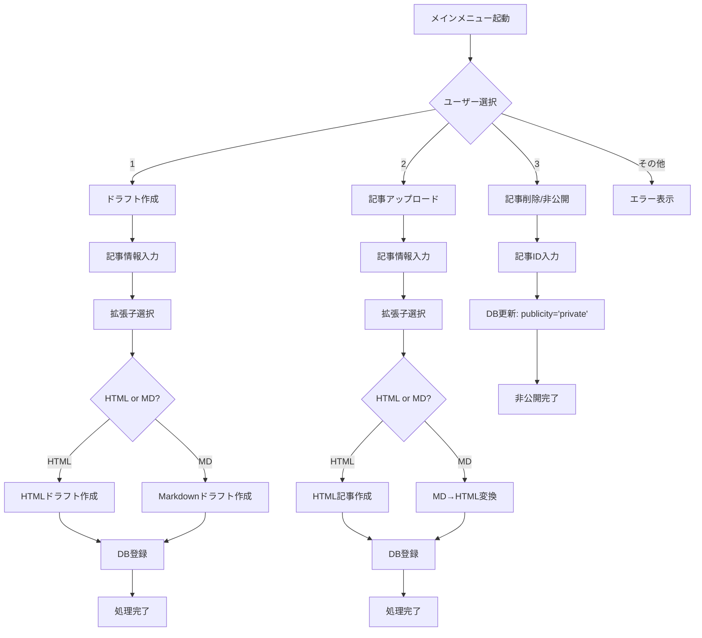
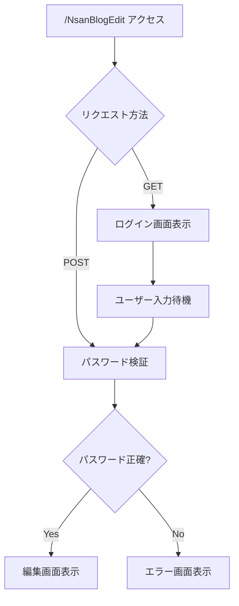

# ブログシステム フローチャート

## メイン処理フロー



## ログイン・認証フロー



## DB操作フロー

```mermaid
flowchart TD
    A["DB操作開始"] --> B[".env読み込み"]
    B --> C["DB接続情報取得"]
    C --> D["MySQL接続"]
    D --> E{"接続成功?"}
    E -->|No| F["エラー処理"]
    E -->|Yes| G["テーブル存在確認"]
    G --> H{"テーブル存在?"}
    H -->|No| I["テーブル作成"]
    H -->|Yes| J["SQL実行"]
    I --> J
    J --> K["コミット"]
    K --> L["接続クローズ"]
    L --> M["処理完了"]
    F --> N["エラー表示"]
````