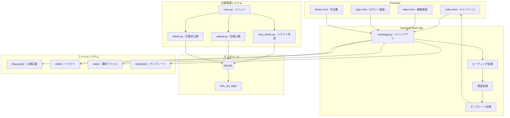
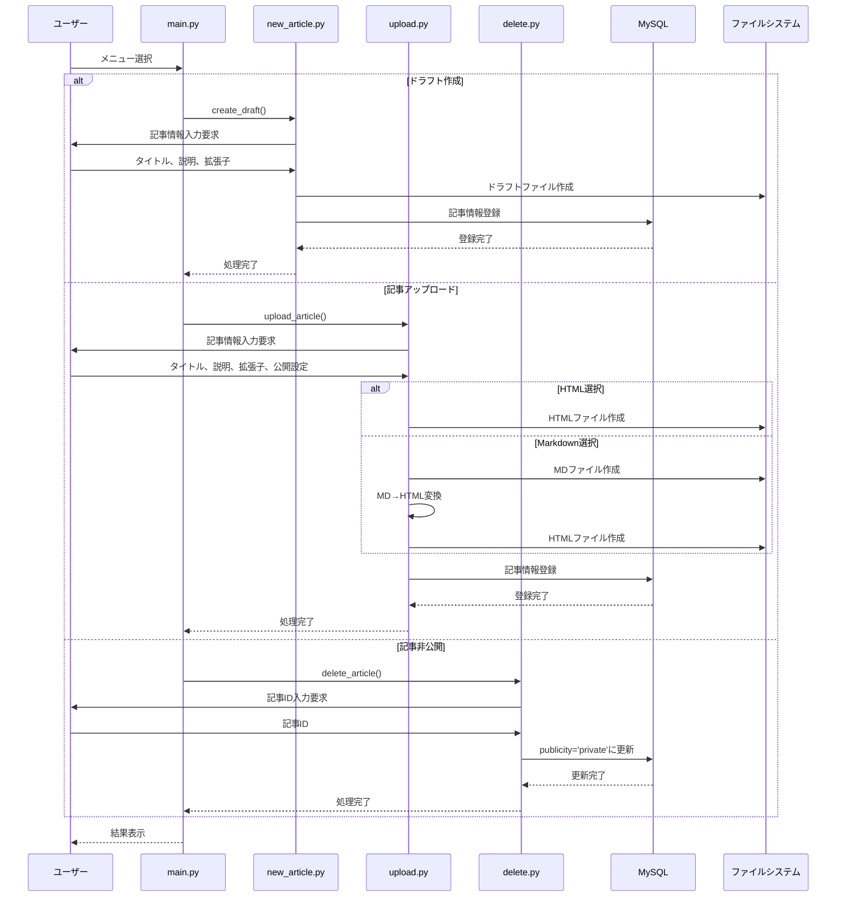

# ブログシステム アーキテクチャ図

## システム全体構成

```mermaid
graph TB
    subgraph "Frontend"
        A[index.html - メインページ]
        B[editor.html - 編集画面]
        C[login.html - ログイン画面]
        D[Works.html - 作品集]
    end
    
    subgraph "Backend Flask App"
        E[mainpage.py - メインアプリ]
        F[ルーティング処理]
        G[認証処理]
        H[テンプレート処理]
    end
    
    subgraph "記事管理システム"
        I[new_article.py - ドラフト作成]
        J[upload.py - 記事公開]
        K[delete.py - 記事非公開]
        L[main.py - メニュー]
    end
    
    subgraph "データベース"
        M[(MySQL)]
        N[URL_list_table]
    end
    
    subgraph "ファイルシステム"
        O[blog-posts/ - 公開記事]
        P[drafts/ - ドラフト]
        Q[static/ - 静的ファイル]
        R[templates/ - テンプレート]
    end
    
    A --> E
    B --> E
    C --> E
    D --> E
    E --> F
    F --> G
    G --> H
    H --> A
    
    L --> I
    L --> J
    L --> K
    I --> M
    J --> M
    K --> M
    
    E --> O
    E --> P
    E --> Q
    E --> R
    
    M --> N
```

## データフロー図

```mermaid
sequenceDiagram
    participant U as ユーザー
    participant M as main.py
    participant N as new_article.py
    participant UP as upload.py
    participant D as delete.py
    participant DB as MySQL
    participant FS as ファイルシステム
    
    U->>M: メニュー選択
    alt ドラフト作成
        M->>N: create_draft()
        N->>U: 記事情報入力要求
        U->>N: タイトル、説明、拡張子
        N->>FS: ドラフトファイル作成
        N->>DB: 記事情報登録
        DB-->>N: 登録完了
        N-->>M: 処理完了
    else 記事アップロード
        M->>UP: upload_article()
        UP->>U: 記事情報入力要求
        U->>UP: タイトル、説明、拡張子、公開設定
        alt HTML選択
            UP->>FS: HTMLファイル作成
        else Markdown選択
            UP->>FS: MDファイル作成
            UP->>UP: MD→HTML変換
            UP->>FS: HTMLファイル作成
        end
        UP->>DB: 記事情報登録
        DB-->>UP: 登録完了
        UP-->>M: 処理完了
    else 記事非公開
        M->>D: delete_article()
        D->>U: 記事ID入力要求
        U->>D: 記事ID
        D->>DB: publicity='private'に更新
        DB-->>D: 更新完了
        D-->>M: 処理完了
    end
    M-->>U: 結果表示
```